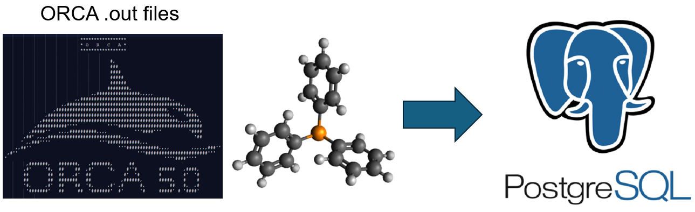

<h1 align="center">orca-data-to-db ⚛️📊</h1>

  
  

> Scripts for moving data from ORCA (in the form of CSV/JSON files, etc.) into databases.

### 🏠 [Homepage](github.com/pmwaddell/orca-data-to-db)

## Setup and Operation

Note: if you are cloning this repo, run create_postgres_directories.sh using BASH before doing anything else. 
This is needed because PostgresQL requires the presence of some empty directories under postgres_data, and 
because they are empty they are not captured by Git. 

Note that I admittedly haven't really tested this, but running it should at least ensure that the same 
file structure under postgres_data is recapitulated.

Using BASH, navigate to orca-data-to-db/orca-data-to-db/src/ directory. 
Then, run the command "docker compose --env-file dev.env up", which will start the Docker containers 
for Mage, PostgreSQL, and pgAdmin.

From there, execute the script "orca_data_to_postgres.py". 
This should move the ORCA data in your specified .csv files (as produced by 
https://github.com/pmwaddell/orca-data-extraction) into Postgres. 
The script will attempt to concatenate all .csv files in the current directory into a single table.

The data can be viewed in Postgres from pgAdmin at localhost:8080, using the login information specified 
in the dev.env file and registering the appropriate server by giving the host name, username and password 
from the dev.env file (the default port of 5432 should work). 

Mage can be accessed from localhost:6789. To configure the connection to GCP, create a project and 
associated Service Account with appropriate Permissions (e.g., BigQuery Admin) and create a key for 
the account. Place the key in a directory called "personal-gcp.json" in the src directory. Be careful 
as always not to share this key file unnecessarily. In future, these steps should be covered by Terraform.

The pipeline postgres_to_bq can be run once the ORCA data has been loaded into Postgres. 
This should create a schema and table in BigQuery containing your cleaned data. Likewise, the pipeline 
postgres_to_postgres will clean the data and create a new schema in Postgres to store it.

There are also pipelines from Postgres to BigQuery and Postgres which normalize the data, 
postgres_to_postgres_with_normalization and postgres_to_bq_with_normalization. These create a table 
for each data section, related by the name of the ORCA .out file for that calculation. 

## Author

👤 **Peter Waddell**

* Website: https://github.com/pmwaddell
* Github: [@pmwaddell](https://github.com/pmwaddell)
* LinkedIn: [@https:\/\/www.linkedin.com\/in\/peter-waddell-ph-d-00b95265\/](https://linkedin.com/in/https:\/\/www.linkedin.com\/in\/peter-waddell-ph-d-00b95265\/)

## Show your support

Give a ⭐️ if this project helped you!

## 📝 License

Copyright © 2024 [Peter Waddell](https://github.com/pmwaddell). 
This project is [MIT](https://www.mit.edu/~amini/LICENSE.md) licensed.
